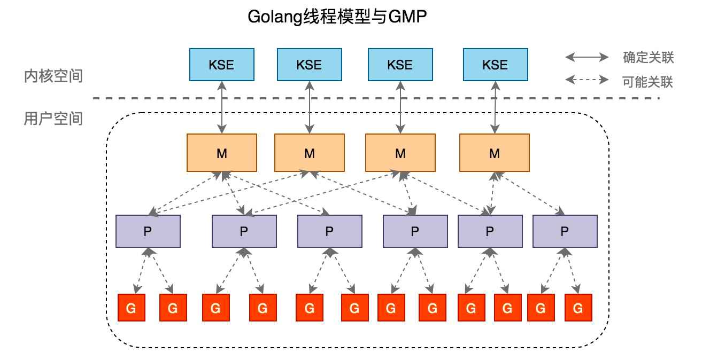
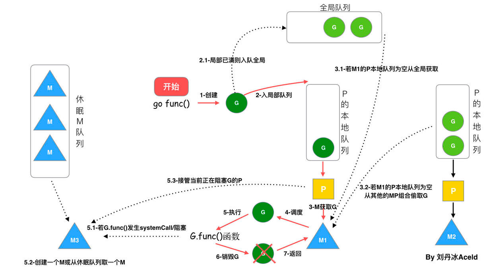

# 常见面试问题总结-Golang-GMP

## 1、GMP是什么？

GPM是一种并发执行模型，用于描述Goroutine Scheduler如何管理和调度goroutine并在多个处理器（Processor）上执行。M:N调度模型，其中M代表逻辑处理器（P），N代表系统线程（OS Thread）。

1. Goroutine（G）：Goroutine是Golang并发的基本单位，它代表着一个独立的执行线程。Goroutine是由Go关键字启动的，并由Scheduler调度执行。Goroutine之间可以通过channel进行通信和同步。
2. Processor（P）：Processor代表runtime中的逻辑处理器，它负责调度和执行goroutine。runtime会创建一组逻辑处理器，并将goroutine分配给这些处理器上的线程来执行。
3. Machine（M）：Machine指的是系统线程。runtime会将处理器资源映射到逻辑处理器上，并通过调度goroutine在这些处理器上执行。
   
## 2、GMP调度流程是什么？

- 线程M想运行任务就需得获取 P，即与P关联。

- 然从 P 的本地队列(LRQ)获取 G

- 若LRQ中没有可运行的G，M 会尝试从全局队列(GRQ)拿一批G放到P的本地队列，

- 若全局队列也未找到可运行的G时候，M会随机从其他 P 的本地队列偷一半放到自己 P 的本地队列。

- 拿到可运行的G之后，M 运行 G，G 执行之后，M 会从 P 获取下一个 G，不断重复下去。
  

## 3、G M P的数量？

G 的数量：

理论上没有数量上限限制的。查看当前G的数量可以使用`runtime. NumGoroutine()`

P 的数量：

由启动时环境变量 `$GOMAXPROCS` 或者是由`runtime.GOMAXPROCS()` 决定。这意味着在程序执行的任意时刻都只有 $GOMAXPROCS 个 goroutine 在同时运行。

M 的数量:

go 语言本身的限制：go 程序启动时，会设置 M 的最大数量，默认 10000. 但是内核很难支持这么多的线程数，所以这个限制可以忽略。 runtime/debug 中的 SetMaxThreads 函数，设置 M 的最大数量 一个 M 阻塞了，会创建新的 M。M 与 P 的数量没有绝对关系，一个 M 阻塞，P 就会去创建或者切换另一个 M，所以，即使 P 的默认数量是 1，也有可能会创建很多个 M 出来。

## 4、G M P的内部结构？

```go
type g struct {
    stack       stack   // g自己的栈
    m            *m      // 隶属于哪个M
    sched        gobuf   // 保存了g的现场，goroutine切换时通过它来恢复
    atomicstatus uint32  // G的运行状态
    goid         int64
    schedlink    guintptr // 下一个g, g链表
    preempt      bool //抢占标记
    lockedm      muintptr // 锁定的M,g中断恢复指定M执行
    gopc          uintptr  // 创建该goroutine的指令地址
    startpc       uintptr  // goroutine 函数的指令地址
}

type m struct {
    g0      *g     // g0, 每个M都有自己独有的g0

    curg          *g       // 当前正在运行的g
    p             puintptr // 隶属于哪个P
    nextp         puintptr // 当m被唤醒时，首先拥有这个p
    id            int64
    spinning      bool // 是否处于自旋

    park          note
    alllink       *m // on allm
    schedlink     muintptr // 下一个m, m链表
    mcache        *mcache  // 内存分配
    lockedg       guintptr // 和 G 的lockedm对应
    freelink      *m // on sched.freem
}

type p struct {
    id          int32
    status      uint32 // P的状态
    link        puintptr // 下一个P, P链表
    m           muintptr // 拥有这个P的M
    mcache      *mcache  

    // P本地runnable状态的G队列，无锁访问
    runqhead uint32
    runqtail uint32
    runq     [256]guintptr
    
    runnext guintptr // 一个比runq优先级更高的runnable G

    // 状态为dead的G链表，在获取G时会从这里面获取
    gFree struct {
        gList
        n int32
    }

    gcBgMarkWorker       guintptr // (atomic)
    gcw gcWork

}
```

## 5、总结

1. Golang的线程模型采用的是混合型线程模型，线程与协程关系是N:M。

2. Golang混合型线程模型实现采用GMP模型进行调度，G是goroutine，是golang实现的协程，M是OS线程，P是逻辑处理器。

3. 每一个M都需要与一个P绑定，P拥有本地可运行G队列，M是执行G的单元，M获取可运行G流程是先从P的本地队列获取，若未获取到，则从其他P偷取过来（即work steal)，若其他的P也没有则从全局G队列获取，若都未获取到，则M将处于自旋状态，并不会销毁。

4. 当执行G时候，发生通道阻塞等用户级别阻塞时候，此时M不会阻塞，M会继续寻找其他可运行的G，当阻塞的G恢复之后，重新进入P的队列等待执行，若G进行系统调用时候，会阻塞M，此时P会和M解绑(即hand off)，并寻找新的空闲的M。若没有空闲的就会创建一个新的M。

5. Work Steal和Hand Off保证了线程的高效利用。


**G-M-P高效的保证策略有：**

- M是可以复用的，不需要反复创建与销毁，当没有可执行的Goroutine时候就处于自旋状态，等待唤醒

- Work Stealing和Hand Off策略保证了M的高效利用

- 内存分配状态(mcache)位于P，G可以跨M调度，不再存在跨M调度局部性差的问题

- M从关联的P中获取G，不需要使用锁，是lock free的
