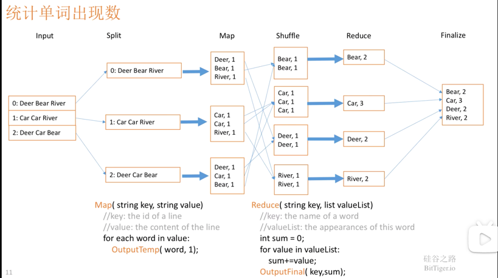
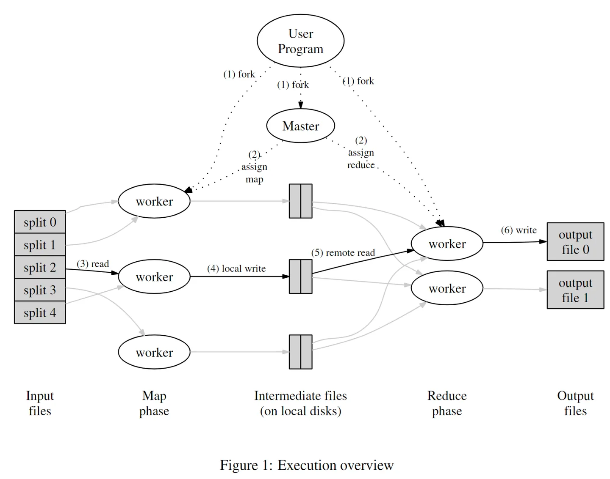

## 1、MapReduce简介
分布式计算方案MapReduce，是一种编程模型，用于大规模数据集的并行运算，其中包括Map（映射）和Reduce（归约）。
MapReduce既是一个编程模型，也是一个计算组件，处理的过程分为以下阶段：
- Map阶段： 在Map阶段中，MapReduce将输入数据分割成若干个小块，然后在分布式计算集群上同时执行多个Map任务，
每个任务都对一个小块的数据进行处理，并将处理结果输出为一系列键值对，Map任务的输出结果会被临时存储在本地磁盘或内存中，
以供Reduce任务使用。
- shuffle阶段：
  - 合并相同 Key 的 Value：Map 任务输出的键值对可能会包含相同的 Key，Shuffle 过程会将相同 Key 的 Value 合并在一起，减少 Reduce 任务需要处理的数据量。
  - 按照 Key 进行排序：Shuffle 过程会将 Map 任务的输出结果按照 Key 进行排序，这样 Reduce 任务可以顺序地处理键值对序列，避免在处理数据时需要进行额外的排序操作。
  - 划分数据并传输：Shuffle 过程会将 Map 任务的输出结果按照 Key 划分成多个分区，并将每个分区的数据传输到对应的 Reduce 任务中。这样，Reduce 任务可以从不同的 Map 任务中获取到数据，从而实现更好的并行化处理。
- Reduce阶段：负责把多个小任务的处理结果进行汇总。其中Map阶段主要输入是一对Key-Value，经过map计算后输出一对Key-Value值；
然后将相同Key合并，形成Key-Value集合；再将这个Key-Value集合转入Reduce阶段，经过计算输出最终Key-Value结果集。

**本质上是一种分而治之、并行计算的思想，将大任务分解为多个小任务，然后将多个小任务的结果进行汇总，得到最终结果。**

上图展示了我们所实现的MapReduce操作的整体工作流程。当用户程序调用MapReduce函数时，将会发生下面一系列的动作（下面的序号与图中的序号一一对应）。

用户程序中的MapReduce库会先将输入文件切分为M个片段，通常每个片段的大小在16MB到64MB之间（具体大小可以由用户通过可选参数来进行指定）。接着，它会在集群中启动许多个程序副本。
有一个程序副本是比较特殊的，那就是master。剩下的副本都是worker，master会对这些worker进行任务分配。这里有M个Map任务以及R个Reduce任务要进行分配。master会给每个空闲的worker分配一个map任务或者一个reduce任务。
被分配了map任务的worker会读取相关的输入数据片段。它会从输入数据中解析出键值对，并将它们传入用户定义的Map函数中。Map函数所生成的中间键值对会被缓存在内存中（知秋注：用户自定义的map函数只是中间的一环而已，我们其实可以将这个map看作map(K,V,BiFunction>) K是文件名，V是文件内容，BiFunction就是我们自己定义的map规则）。
每隔一段时间，被缓存的键值对会被写入到本地硬盘，并通过分区函数分到R个区域内。这些被缓存的键值对在本地磁盘的位置会被传回master。master负责将这些位置转发给执行reduce操作的worker。
当master将这些位置告诉了某个执行reduce的worker，该worker就会使用RPC的方式去从保存了这些缓存数据的map worker的本地磁盘中读取数据。当一个reduce worker读取完了所有的中间数据后，它就会根据中间键进行排序，这样使得具有相同键值的数据可以聚合在一起。之所以需要排序是因为通常许多不同的key会映射到同一个reduce任务中。如果中间数据的数量太过庞大而无法放在内存中，那就需要使用外部排序。
reduce worker会对排序后的中间数据进行遍历。然后，对于遇到的每个唯一的中间键，reduce worker会将该key和对应的中间value的集合传入用户所提供的Reduce函数中。Reduce函数生成的输出会被追加到这个reduce分区的输出文件中。
当所有的map任务和reduce任务完成后，master会唤醒用户程序。此时，用户程序会结束对MapReduce的调用。
在成功完成任务后，MapReduce的输出结果会存放在R个输出文件中（每个reduce任务都会生成对应的文件，文件名由用户指定）。一般情况下，用户无需将这些文件合并为一个文件。他们通常会将这些文件作为输入传入另一个MapReduce调用中。或者在另一个可以处理这些多个分割文件的分布式应用中使用。
