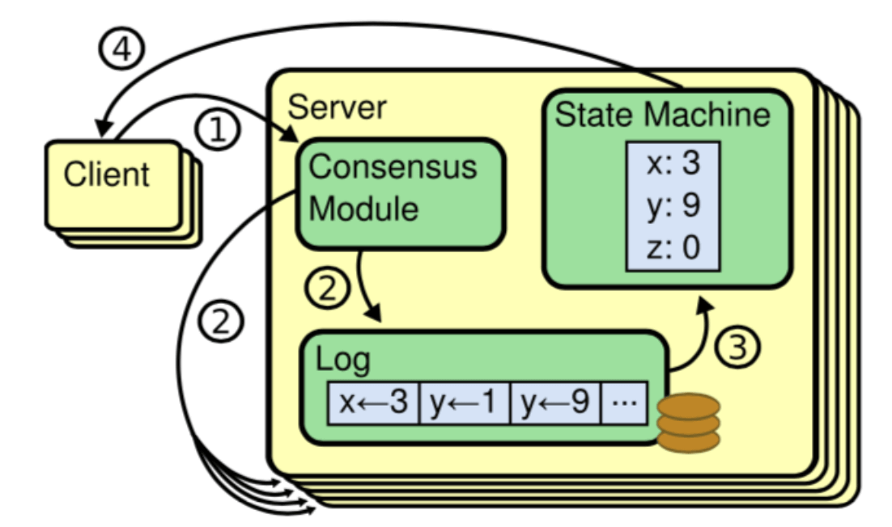
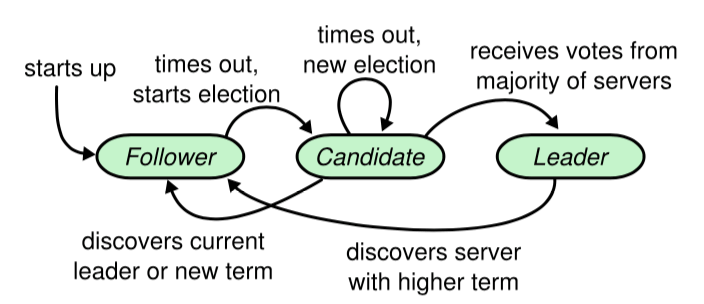
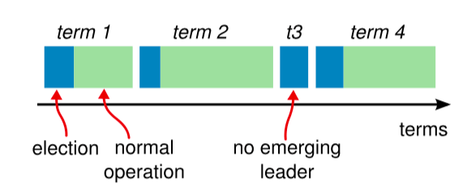

# Raft算法

## 背景
  随着数据规模越来越大，需要额外的机器进行横向扩展，于是有了分布式架构，但是分布式架构也带来了新的问题，
  比如发生分区(partition)后，会导致数据不一致，所以需要一种算法来保证共，这就是raft要解决的问题
  
## 共识算法
  共识是可容错系统中的一个基本问题：
  即使面对故障，服务器也可以在共享状态上达成一致。共识算法允许一组节点像一个整体一样一起工作，
  即使其中的一些节点出现故障也能够继续工作下去，其正确性主要是源于复制状态机的性质：一组Server的状态机计算相同状态的副本，
  即使有一部分的Server宕机了它们仍然能够继续运行。

  通过使用复制日志来实现复制状态机。每个Server存储着一份包括命令序列的日志文件，状态机会按顺序执行这些命令。
  因为每个日志包含相同的命令，并且顺序也相同，所以每个状态机处理相同的命令序列。由于状态机是确定性的，

  所以处理相同的状态，得到相同的输出。因此共识算法的工作就是保持复制日志的一致性。服务器上的共识模块从客户端接收命令并将它们添加到日志中。
  它与其他服务器上的共识模块通信，以确保即使某些服务器发生故障。每个日志最终包含相同顺序的请求。一旦命令被正确地复制，
  它们就被称为已提交。每个服务器的状态机按照日志顺序处理已提交的命令，并将输出返回给客户端，因此，这些服务器形成了一个单一的、
  高度可靠的状态机。

  因此共识算法的工作就是保持复制日志的一致性。服务器上的共识模块从客户端接收命令并将它们添加到日志中。
  它与其他服务器上的共识模块通信，以确保即使某些服务器发生故障。每个日志最终包含相同顺序的请求。
  一旦命令被正确地复制，它们就被称为已提交。每个服务器的状态机按照日志顺序处理已提交的命令，并将输出返回给客户端，
  因此，这些服务器形成了一个单一的、高度可靠的状态机。
### 节点类型
在任意的时间，每个服务器一定会处于以下三个状态中的一个：
* Leader：负责发起心跳，响应客户端，创建日志，同步日志。
* Candidate：Leader 选举过程中的临时角色，由 Follower 转化而来，发起投票参与竞选。
* Follower：接受 Leader 的心跳和日志同步数据，投票给 Candidate。
在正常的情况下，只有一个服务器是 Leader，剩下的服务器是 Follower。Follower 是被动的，它们不会发送任何请求，只是响应来自 Leader 和 Candidate 的请求。

### 任期
raft 算法将时间划分为任意长度的任期（term），任期用连续的数字表示，看作当前 term 号。
每一个任期的开始都是一次选举，在选举开始时，一个或多个 Candidate 会尝试成为 Leader。
如果一个 Candidate 赢得了选举，它就会在该任期内担任 Leader。如果没有选出 Leader，将会开启另一个任期，
并立刻开始下一次选举。raft 算法保证在给定的一个任期最少要有一个 Leader。每个节点都会存储当前的 term 号，
当服务器之间进行通信时会交换当前的 term 号；如果有服务器发现自己的 term 号比其他人小，那么他会更新到较大的 term 值。
如果一个 Candidate 或者 Leader 发现自己的 term 过期了，他会立即退回成 Follower。
如果一台服务器收到的请求的 term 号是过期的，那么它会拒绝此次请求。

### 日志
- entry：每一个事件成为 entry，只有 Leader 可以创建 entry。entry 的内容为<term,index,cmd>
其中 cmd 是可以应用到状态机的操作。
- log：由 entry 构成的数组，每一个 entry 都有一个表明自己在 log 中的 index。
只有 Leader 才可以改变其他节点的 log。entry 总是先被 Leader 添加到自己的 log 数组中，然后再发起共识请求，
获得同意后才会被 Leader 提交给状态机。Follower 只能从 Leader 获取新日志和当前的 commitIndex，
然后把对应的 entry 应用到自己的状态机中。#

## 领导人选举

raft 使用心跳机制来触发 Leader 的选举。

如果一台服务器能够收到来自 Leader 或者 Candidate 的有效信息，
那么它会一直保持为 Follower 状态，并且刷新自己的 electionElapsed，重新计时。
Leader 会向所有的 Follower 周期性发送心跳来保证自己的 Leader 地位。如果一个 Follower 在一个周期内没有收到心跳信息，
就叫做选举超时，然后它就会认为此时没有可用的 Leader，并且开始进行一次选举以选出一个新的 Leader。

为了开始新的选举， Follower 会自增自己的 term 号并且转换状态为 Candidate。然后他会向所有节点发起 RequestVoteRPC 请求， 
Candidate 的状态会持续到以下情况发生：
- 赢得选举
- 其他节点赢得选举
- 一轮选举结束，无人胜出

赢得选举的条件是：
一个 Candidate 在一个任期内收到了来自集群内的多数选票（N/2+1），就可以成为 Leader。

在 Candidate 等待选票的时候，它可能收到其他节点声明自己是 Leader 的心跳，此时有两种情况：
- 该 Leader 的 term 号大于等于自己的 term 号，说明对方已经成为 Leader，则自己回退为 Follower。
- 该 Leader 的 term 号小于自己的 term 号，那么会拒绝该请求并让该节点更新 term。
- 
由于可能同一时刻出现多个 Candidate， 导致没有 Candidate 获得大多数选票，如果没有其他手段来重新分配选票的话，
那么可能会无限重复下去。 raft 使用了随机的选举超时时间来避免上述情况。每一个 Candidate 在发起选举后，
都会随机化一个新的选举超时时间， 这种机制使得各个服务器能够分散开来，在大多数情况下只有一个服务器会率先超时；
它会在其他服务器超时之前赢得选举

## 日志复制
一旦选出了 Leader，它就开始接受客户端的请求。 每一个客户端的请求都包含一条需要被复制状态机（Replicated State Mechine）执行的命令。

Leader 收到客户端请求后，会生成一个 entry，包含<index,term,cmd>，再将这个 entry 添加到自己的日志末尾后，
向所有的节点广播该 entry，要求其他服务器复制这条 entry。

如果 Follower 接受该 entry，则会将 entry 添加到自己的日志后面， 同时返回给 Leader 同意。

如果 Leader 收到了多数的成功响应，Leader 会将这个 entry 应用到自己的状态机中，
之后可以成为这个 entry 是 committed 的，并且向客户端返回执行结果。

raft 保证以下两个性质：在两个日志里，有两个 entry 拥有相同的 index 和 term，那么它们一定有相同的 cmd在两个日志里，
有两个 entry 拥有相同的 index 和 term，那么它们前面的 entry 也一定相同通过“仅有 Leader 可以生成 entry”来保证第一个性质，
第二个性质需要一致性检查来进行保证。一般情况下，Leader 和 Follower 的日志保持一致，然后，Leader 的崩溃会导致日志不一样，
这样一致性检查会产生失败。Leader 通过强制 Follower 复制自己的日志来处理日志的不一致。

这就意味着，在 Follower 上的冲突日志会被领导者的日志覆盖。
为了使得 Follower 的日志和自己的日志一致，Leader 需要找到 Follower 与它日志一致的地方，
然后删除 Follower 在该位置之后的日志，接着把这之后的日志发送给 Follower。Leader 给每一个Follower 
维护了一个 nextIndex，它表示 Leader 将要发送给该追随者的下一条日志条目的索引。当一个 Leader 开始掌权时，
它会将 nextIndex 初始化为它的最新的日志条目索引数+1。

如果一个 Follower 的日志和 Leader 的不一致，AppendEntries 
一致性检查会在下一次 AppendEntries RPC 时返回失败。在失败之后，Leader 会将 nextIndex 递减然后重试 AppendEntries RPC。
最终 nextIndex 会达到一个 Leader 和 Follower 日志一致的地方。这时，AppendEntries 会返回成功，
Follower 中冲突的日志条目都被移除了，并且添加所缺少的上了 Leader 的日志条目。一旦 AppendEntries 返回成功，
Follower 和 Leader 的日志就一致了，这样的状态会保持到该任期结束

