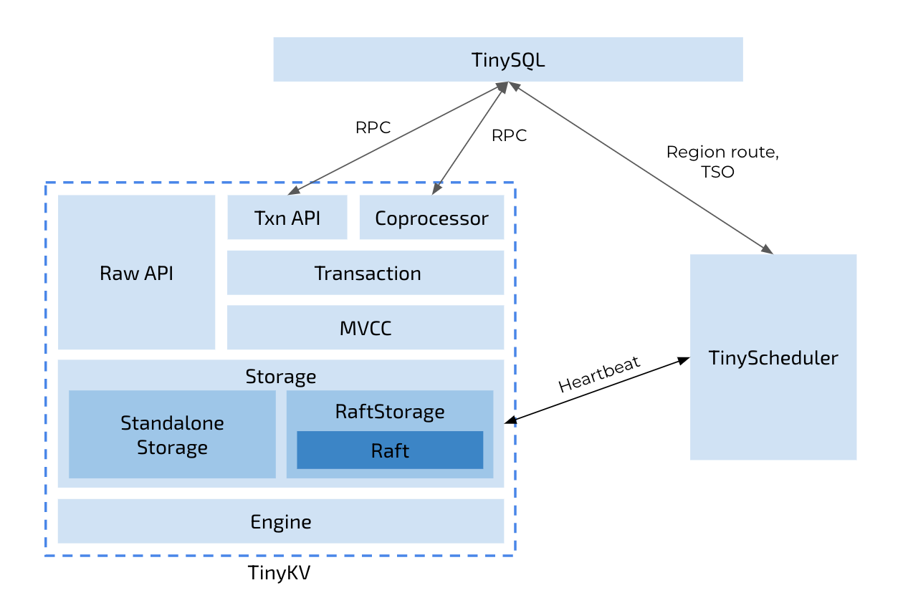
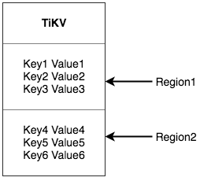
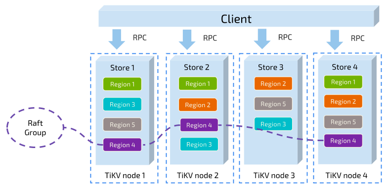

## TinyKV
使用Raft共识算法实现的KV存储，代码结构如下：
  
  
## Raft共识算法
  共识算法[raft](https://github.com/maemual/raft-zh_cn/blob/master/raft-zh_cn.md)，提供几个重要功能：
- Leader选举
- 成员变更
- 日志复制

TiKV 利用 Raft 来做数据复制，每个数据变更都会落地为一条 Raft 日志，通过 Raft 的日志复制功能，将数据安全可靠地同步到 Group 的多数节点中。
数据的写入是通过 Raft 这一层的接口写入，而不是直接写 RocksDB。通过实现 Raft，我们拥有了一个分布式的 KV，现在再也不用担心某台机器挂掉了。
## KV存储
- 这是一个巨大的 Map，也就是存储的是 Key-Value pair，都是Byte数组
- 这个 Map 中的 Key-Value pair 按照 Key 的二进制顺序有序，
也就是我们可以 Seek 到某一个 Key 的位置，然后不断的调用 Next 方法以递增的顺序获取比这个 Key 大的 Key-Value
## RocksDB
TinyKV并没有直接向磁盘写数据，而是把数据保存在RocksDB中，由RocksDB来管理磁盘的读写。
## Region
将 TiKV 看做一个巨大的有序的 KV Map，那么为了实现存储的水平扩展，需要将数据分散在多台机器上。对于一个 KV 系统，
将数据分散在多台机器上有两种比较典型的方案：一种是按照 Key 做 Hash，根据 Hash 值选择对应的存储节点；
另一种是分 Range，某一段连续的 Key 都保存在一个存储节点上。TiKV 选择了第二种方式，将整个 Key-Value 空间分成很多段，
每一段是一系列连续的 Key，我们将每一段叫做一个 Region，并且我们会尽量保持每个 Region 中保存的数据不超过一定的大小
(这个大小可以配置，目前默认是 96mb)。每一个 Region 都可以用 StartKey 到 EndKey 这样一个左闭右开区间来描述。

- 以 Region 为单位，将数据分散在集群中所有的节点上，并且尽量保证每个节点上服务的 Region 数量差不多
- 以 Region 为单位做 Raft 的复制和成员管理
  
## CF(colomn family)
将多个列聚合成一个列族，类似于Mysql的垂直分表，因为查询可能并不需要将一整行的所有列数据全部返回
如果不是用CF，那么有2种设计方案：
- 1.把所有列的数据放在一个文件中（也就是传统的按行存储）。那么当我们想要访问少数几个列的数据时，需要遍历每一行，读取整个表的数据，这样子是很低效的。
- 把每个列的数据单独分开存在一个文件中（按列存储）。那么当我们想要访问少数几个列的数据时，只需要读取对应的文件，不用读取整个表的数据，读取效率很高。然而，由于稀疏表通常会有很多列，这会导致文件数量特别多，这本身会影响文件系统的效率。

于是CF将2种方案进行折中。
