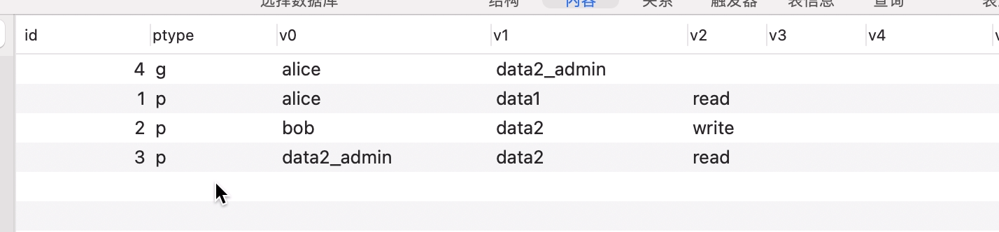

## Casbin是什么

[casbin](https://github.com/casbin/casbin)是一个强大的开源访问控制组件，用来实现各种访问控制模型的授权，支持```golang```,```java```,```php```,```python```,```c++```等众多语言。简单来说，用来控制哪些用户能访问哪些接口，或者哪几类用户能访问哪几类接口。注意需要区分认证与授权。<mark>认证：你是谁，授权：你能做什么</mark>

## Casbin的原理

`Casbin`基于PERM模型(`policy, Effect, Request, Matchers`)实现，将所有定义放在一个`conf`文件中，下面是最常见的`RBAC`模型的`conf`文件：

```go
[request_definition] 
r = sub, obj, act

[policy_definition]
p = sub, obj, act

[role_definition]
g = _, _

[policy_effect]
e = some(where (p.eft == allow))

[matchers]
m = g(r.sub, p.sub) && r.obj == p.obj && r.act == p.act
```

`sub`是角色，`obj`是请求的资源，`act`是行为，通过`matchers`的运算后满足policy_effect的结果即为授权通过，否则将拒绝。通过另一份`policy`名单我们就可以按照上述定义的规则来实现授权操作。`policy`的格式有多种，如`csv`或者数据库表等，在实际项目中我们多使用`MySQL`来存储`policy`以便进行持久化。

其内容如下：

```csv
p, alice, data1, read
p, bob, data2, write
```

这意味着`alice`能够读取`data1`，`bob`能够写`data2`。

## Casbin如何使用：

下面通过一段简单的实例程序来演示如何使用`Casbin`：

```go
package main

import (
	"github.com/casbin/casbin/v2"
	gormadapter "github.com/casbin/gorm-adapter/v3"
	"gorm.io/driver/mysql"
	"gorm.io/gorm"
	"time"
)

func main() {
	dsn := "root:123456@tcp(127.0.0.1:3306)/testdatabase?charset=utf8mb4&parseTime=True&loc=Local"
	db, err := gorm.Open(mysql.Open(dsn), &gorm.Config{})
	if err != nil {
		panic(err)
	}
	//adapter将会自动创建一张表来存储策略
	a, err := gormadapter.NewAdapterByDBUseTableName(db, "tb", "casbin")
	if err != nil {
		panic(err)
	}
	//需要指定model.conf的路径
	e, err := casbin.NewSyncedEnforcer("./model.conf", a)
	if err != nil {
		panic(err)
	}
	e.LoadPolicy()
	//定时刷新策略
	e.StartAutoLoadPolicy(10 * time.Second)
    //Addpolicy将会添加一条策略，如下所示将允许alice读取data1
	e.AddPolicy("alice", "data1", "read")
	e.AddPolicy("bob", "data2", "write")
	e.AddPolicy("data2_admin", "data2", "read")
    //添加组策略，含义数alice继承data2_admin的所有权限，这样一来alice将拥有了data2的read权限
	e.AddGroupingPolicy("alice", "data2_admin")
    //将上述的策略进行持久化
	e.SavePolicy()
    //Enforce(),最关键的方法，调用该方法即可判断用户的访问是否被允许
	if res, _ := e.Enforce("alice", "data2", "read"); res {
		println("alice can read data2")
	} else {
		println("alice can not read data2")
	}
}
```

数据库中创建的表如下：



## 实际项目的应用：

经过上面的演示，我们已经掌握了`Casbin`的用法，在实际项目中，授权功能多是在中间件层完成，因此我们可以将`Casbin`作为中间件层的拦截器，请求到达中间件层即可进行拦截。

```go
func casbinAuth(e *casbin.Enforcer) gin.HandlerFunc {
   return func(c *gin.Context) {
      //获取接口，即资源
      obj := c.Request.URL.RequestURI()
      // 获取方法
      act := c.Request.Method
      //假设user通过认证中间件已经添加在context中
      sub := c.Get("user")

      // 判断策略是否已经存在
      if ok := e.Enforce(sub, obj, act); ok {
         log.Println("Check successfully")
         c.Next()
      } else {
         log.Println("sorry , Check failed")
         c.Abort()
      }
   }
}
```